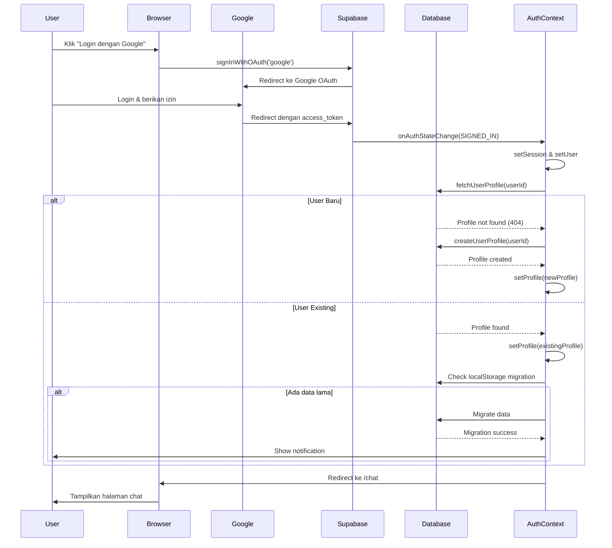

# Alur Autentikasi Lengkap - SpecWeave

## Pertanyaan
**"Flowchart ini menggambarkan alur autentikasi pengguna sebagaimana disajikan pada Gambar 3.2. Alur dimulai ketika pengguna membuka halaman login dan menekan tombol "Login dengan Google" untuk memulai proses OAuth. Sistem memvalidasi kredensial melalui Google Authentication. Apabila autentikasi gagal, sistem menampilkan pesan kesalahan dan mengarahkan pengguna kembali ke halaman login. Apabila berhasil, sistem menyimpan profil ke tabel profiles (untuk pengguna baru) lalu mengarahkan pengguna ke halaman chat utama. Untuk pengguna yang sudah pernah masuk aplikasi gimana?"**

---

## Jawaban Lengkap

### Alur untuk Pengguna Baru vs Pengguna Existing

Sistem **OTOMATIS** mendeteksi apakah pengguna baru atau sudah terdaftar, dan menangani keduanya dengan cara yang berbeda:

---

## Flowchart Lengkap (Pengguna Baru + Existing)

```
┌─────────────────────────────────────────────────────────────┐
│  User membuka halaman login                                  │
│  (Landing Page)                                              │
└────────────────────────┬────────────────────────────────────┘
                         │
                         ▼
┌─────────────────────────────────────────────────────────────┐
│  User klik "Login dengan Google"                            │
│  (signInWithGoogle)                                          │
└────────────────────────┬────────────────────────────────────┘
                         │
                         ▼
┌─────────────────────────────────────────────────────────────┐
│  Sistem menyimpan mode auth ke sessionStorage               │
│  sessionStorage.setItem('auth_mode', 'signup')              │
└────────────────────────┬────────────────────────────────────┘
                         │
                         ▼
┌─────────────────────────────────────────────────────────────┐
│  Redirect ke Google OAuth                                    │
│  (Google Authentication)                                     │
└────────────────────────┬────────────────────────────────────┘
                         │
                         ▼
┌─────────────────────────────────────────────────────────────┐
│  User login di Google                                        │
│  (Pilih akun Google)                                        │
└────────────────────────┬────────────────────────────────────┘
                         │
                ┌────────┴────────┐
                │                 │
           BERHASIL            GAGAL
                │                 │
                │                 ▼
                │     ┌─────────────────────────┐
                │     │  Tampilkan error        │
                │     │  Redirect ke login      │
                │     │  ❌ STOP                │
                │     └─────────────────────────┘
                │
                ▼
┌─────────────────────────────────────────────────────────────┐
│  Google redirect ke /auth/callback                          │
│  dengan access_token                                         │
└────────────────────────┬────────────────────────────────────┘
                         │
                         ▼
┌─────────────────────────────────────────────────────────────┐
│  Supabase Auth menerima token                               │
│  supabase.auth.getSession()                                 │
└────────────────────────┬────────────────────────────────────┘
                         │
                         ▼
┌─────────────────────────────────────────────────────────────┐
│  AuthContext.onAuthStateChange triggered                    │
│  Event: SIGNED_IN                                            │
└────────────────────────┬────────────────────────────────────┘
                         │
                         ▼
┌─────────────────────────────────────────────────────────────┐
│  Set session & user state                                    │
│  setSession(session)                                         │
│  setUser(session.user)                                       │
└────────────────────────┬────────────────────────────────────┘
                         │
                         ▼
┌─────────────────────────────────────────────────────────────┐
│  Simpan token ke localStorage                               │
│  localStorage.setItem('token', access_token)                │
└────────────────────────┬────────────────────────────────────┘
                         │
                         ▼
┌─────────────────────────────────────────────────────────────┐
│  Load user profile dari database                            │
│  loadUserProfile(userId)                                     │
└────────────────────────┬────────────────────────────────────┘
                         │
                         ▼
┌─────────────────────────────────────────────────────────────┐
│  Cek apakah user ada di tabel profiles                      │
│  AuthService.fetchUserProfile(userId)                       │
└────────────────────────┬────────────────────────────────────┘
                         │
        ┌────────────────┴────────────────┐
        │                                 │
    USER BARU                        USER EXISTING
        │                                 │
        ▼                                 ▼
┌──────────────────────┐      ┌──────────────────────────┐
│  Profile TIDAK ADA   │      │  Profile DITEMUKAN       │
│  di database         │      │  di database             │
└──────────┬───────────┘      └──────────┬───────────────┘
           │                              │
           ▼                              ▼
┌──────────────────────┐      ┌──────────────────────────┐
│  Buat profile baru   │      │  Load profile existing   │
│  di tabel profiles   │      │  dari database           │
│                      │      │                          │
│  INSERT INTO         │      │  SELECT * FROM profiles  │
│  profiles (          │      │  WHERE id = userId       │
│    id,               │      │                          │
│    email,            │      │  Data yang di-load:      │
│    name,             │      │  - id                    │
│    avatar_url,       │      │  - email                 │
│    role,             │      │  - name                  │
│    created_at        │      │  - avatar_url            │
│  )                   │      │  - role                  │
└──────────┬───────────┘      │  - created_at            │
           │                  │  - updated_at            │
           │                  │  - preferences           │
           │                  │  - chat history          │
           │                  │  - templates             │
           │                  │  - JIRA connections      │
           │                  └──────────┬───────────────┘
           │                              │
           ▼                              ▼
┌──────────────────────┐      ┌──────────────────────────┐
│  Set profile state   │      │  Set profile state       │
│  setProfile(new)     │      │  setProfile(existing)    │
└──────────┬───────────┘      └──────────┬───────────────┘
           │                              │
           └──────────────┬───────────────┘
                          │
                          ▼
           ┌──────────────────────────────┐
           │  Cek apakah ada data lama    │
           │  di localStorage yang perlu  │
           │  di-migrate ke database      │
           │  (untuk user existing)       │
           └──────────────┬───────────────┘
                          │
              ┌───────────┴───────────┐
              │                       │
          ADA DATA                TIDAK ADA
              │                       │
              ▼                       │
   ┌──────────────────────┐          │
   │  Jalankan migrasi    │          │
   │  LocalStorage → DB   │          │
   │                      │          │
   │  - Chat history      │          │
   │  - Templates         │          │
   │  - Preferences       │          │
   │                      │          │
   │  Tampilkan notif:    │          │
   │  "X items migrated"  │          │
   └──────────┬───────────┘          │
              │                       │
              └───────────┬───────────┘
                          │
                          ▼
           ┌──────────────────────────────┐
           │  Redirect ke halaman chat    │
           │  /chat                       │
           │  ✅ SUCCESS                  │
           └──────────────────────────────┘
```

---

## Detail Setiap Tahap

### 1️⃣ User Klik "Login dengan Google"

**Location:** `aplikasi-klien/src/services/auth/AuthService.js`  
**Function:** `signInWithGoogle()`

```javascript
static async signInWithGoogle(mode = 'signup') {
  // Simpan mode untuk validasi nanti
  sessionStorage.setItem('auth_mode', mode);
  
  // Redirect URL
  const redirectUrl = `${window.location.origin}/auth/callback`;
  
  // Panggil Supabase OAuth
  const { data, error } = await supabase.auth.signInWithOAuth({
    provider: 'google',
    options: {
      redirectTo: redirectUrl,
      queryParams: {
        access_type: 'offline',
        prompt: 'consent',
      }
    }
  });
  
  return { data, error };
}
```

**Yang Terjadi:**
- Mode auth disimpan ke `sessionStorage` ('signup' atau 'signin')
- User di-redirect ke Google OAuth
- Google meminta user untuk login dan memberikan izin

---

### 2️⃣ Google Redirect ke Callback

**URL:** `/auth/callback?access_token=...&refresh_token=...`

**Yang Terjadi:**
- Google mengirim `access_token` dan `refresh_token`
- Supabase Auth otomatis menangkap token ini
- Session dibuat di Supabase

---

### 3️⃣ AuthContext Mendeteksi Login

**Location:** `aplikasi-klien/src/contexts/AuthContext.jsx`  
**Event:** `onAuthStateChange`

```javascript
supabase.auth.onAuthStateChange(async (event, session) => {
  if (event === 'SIGNED_IN' && session?.user) {
    // Set session & user
    setSession(session);
    setUser(session.user);
    
    // Simpan token
    localStorage.setItem('token', session.access_token);
    
    // Load profile
    loadUserProfile(session.user.id);
  }
});
```

**Yang Terjadi:**
- Event `SIGNED_IN` triggered
- Session dan user di-set ke state
- Token disimpan ke localStorage
- Profile di-load dari database

---

### 4️⃣ Load Profile dari Database

**Location:** `aplikasi-klien/src/contexts/AuthContext.jsx`  
**Function:** `loadUserProfile()`

```javascript
const loadUserProfile = async (userId) => {
  // Cek cache dulu
  const cached = profileCache.get(userId);
  if (cached && Date.now() - cached.timestamp < 60000) {
    setProfile(cached.profile);
    return;
  }
  
  // Fetch dari database
  const profileData = await AuthService.fetchUserProfile(userId);
  
  if (profileData) {
    // Simpan ke cache
    setProfileCache(prev => new Map(prev).set(userId, {
      profile: profileData,
      timestamp: Date.now()
    }));
    
    // Set profile state
    setProfile(profileData);
  }
};
```

**Yang Terjadi:**
- Cek cache dulu (untuk performa)
- Jika tidak ada di cache, fetch dari database
- Simpan hasil ke cache dan state

---

### 5️⃣ Fetch Profile dari Database

**Location:** `aplikasi-klien/src/services/auth/AuthService.js`  
**Function:** `fetchUserProfile()`

```javascript
static async fetchUserProfile(userId) {
  try {
    // Query ke tabel profiles
    const { data: profile, error } = await supabase
      .from('profiles')
      .select('*')
      .eq('id', userId)
      .single();
    
    if (error) {
      // Profile tidak ditemukan (user baru)
      if (error.code === 'PGRST116') {
        // Buat profile baru
        return await this.createUserProfile(userId);
      }
      throw error;
    }
    
    // Profile ditemukan (user existing)
    return profile;
  } catch (error) {
    console.error('Fetch profile error:', error);
    return null;
  }
}
```

**Yang Terjadi:**

#### A. **User Baru** (Profile tidak ada):
- Query ke `profiles` return error `PGRST116` (not found)
- Otomatis panggil `createUserProfile()` untuk buat profile baru
- Insert data ke tabel `profiles`:
  ```sql
  INSERT INTO profiles (
    id,
    email,
    name,
    avatar_url,
    role,
    created_at
  ) VALUES (
    'user-id',
    'user@gmail.com',
    'User Name',
    'https://avatar.url',
    'user',
    NOW()
  )
  ```

#### B. **User Existing** (Profile sudah ada):
- Query ke `profiles` return data existing
- Load semua data user:
  - Personal info (name, email, avatar)
  - Role & permissions
  - Preferences & settings
  - Chat history
  - Templates
  - JIRA connections
  - Usage limits

---

### 6️⃣ Migrasi Data (Untuk User Existing)

**Location:** `aplikasi-klien/src/contexts/AuthContext.jsx`  
**Function:** `runMigrationIfNeeded()`

```javascript
const runMigrationIfNeeded = async (user) => {
  // Cek apakah ada data di localStorage yang perlu di-migrate
  const status = LocalStorageMigration.getMigrationStatus();
  
  if (status.canMigrate) {
    // Jalankan migrasi
    const result = await LocalStorageMigration.runMigration();
    
    if (result.success && result.totalMigrated > 0) {
      // Tampilkan notifikasi sukses
      showMigrationNotification(result.totalMigrated);
    }
  }
};
```

**Yang Terjadi (Hanya untuk User Existing):**
- Cek apakah ada data lama di localStorage
- Jika ada, migrate ke database:
  - Chat history → `chat_sessions` table
  - Templates → `user_templates` table
  - Preferences → `profiles.preferences` column
- Tampilkan notifikasi: "X items migrated to database"
- Hapus data dari localStorage setelah migrasi sukses

**Catatan:** User baru tidak perlu migrasi karena belum punya data lama.

---

### 7️⃣ Redirect ke Chat

**Yang Terjadi:**
- Setelah semua proses selesai, user di-redirect ke `/chat`
- User bisa langsung mulai menggunakan aplikasi

---

## Perbedaan User Baru vs User Existing

| Aspek | User Baru | User Existing |
|-------|-----------|---------------|
| **Profile di DB** | Tidak ada, dibuat otomatis | Sudah ada, di-load dari DB |
| **Data yang Di-load** | Data minimal (email, name, avatar) | Data lengkap (history, templates, preferences, JIRA) |
| **Migrasi Data** | Tidak perlu | Jika ada data lama di localStorage |
| **Notifikasi** | Tidak ada | "X items migrated" (jika ada migrasi) |
| **Chat History** | Kosong | Di-load dari database |
| **Templates** | Default templates | Custom templates + default |
| **JIRA Connections** | Tidak ada | Di-load dari database |
| **Usage Limits** | Default limits | Existing usage counters |

---

## Diagram Sequence



---

## Kode Lengkap

### AuthContext.jsx - onAuthStateChange

```javascript
supabase.auth.onAuthStateChange(async (event, session) => {
  console.log('[AUTH] Event:', event);
  
  if (event === 'SIGNED_OUT') {
    // Clear semua state
    setUser(null);
    setSession(null);
    setProfile(null);
    localStorage.clear();
    sessionStorage.clear();
    return;
  }
  
  if (event === 'SIGNED_IN' && session?.user) {
    // Set session & user
    setSession(session);
    setUser(session.user);
    
    // Simpan token
    if (session.access_token) {
      localStorage.setItem('token', session.access_token);
    }
    
    // Load profile (otomatis handle user baru vs existing)
    await loadUserProfile(session.user.id);
    
    // Jalankan migrasi jika perlu (untuk user existing)
    await runMigrationIfNeeded(session.user);
  }
  
  setLoading(false);
});
```

### AuthService.js - fetchUserProfile

```javascript
static async fetchUserProfile(userId) {
  try {
    // Cek cache dulu
    const cached = this.profileCache.get(userId);
    if (cached && Date.now() - cached.timestamp < 60000) {
      return cached.profile;
    }
    
    // Query ke database
    const { data: profile, error } = await supabase
      .from('profiles')
      .select('*')
      .eq('id', userId)
      .single();
    
    if (error) {
      // User baru - profile tidak ada
      if (error.code === 'PGRST116') {
        console.log('[AUTH] New user detected, creating profile...');
        return await this.createUserProfile(userId);
      }
      throw error;
    }
    
    // User existing - profile ditemukan
    console.log('[AUTH] Existing user, profile loaded');
    
    // Simpan ke cache
    this.profileCache.set(userId, {
      profile,
      timestamp: Date.now()
    });
    
    return profile;
  } catch (error) {
    console.error('[AUTH] Fetch profile error:', error);
    return null;
  }
}
```

### AuthService.js - createUserProfile (untuk user baru)

```javascript
static async createUserProfile(userId) {
  try {
    // Get user data dari Supabase Auth
    const { data: { user } } = await supabase.auth.getUser();
    
    if (!user) throw new Error('User not found');
    
    // Buat profile baru
    const newProfile = {
      id: userId,
      email: user.email,
      name: user.user_metadata?.name || user.email.split('@')[0],
      avatar_url: user.user_metadata?.avatar_url || null,
      role: 'user',
      created_at: new Date().toISOString()
    };
    
    // Insert ke database
    const { data: profile, error } = await supabase
      .from('profiles')
      .insert(newProfile)
      .select()
      .single();
    
    if (error) throw error;
    
    console.log('[AUTH] New profile created:', profile);
    return profile;
  } catch (error) {
    console.error('[AUTH] Create profile error:', error);
    throw error;
  }
}
```

---

## Kesimpulan

### Untuk User Baru:
1. Login dengan Google
2. Google redirect dengan token
3. Supabase buat session
4. System cek database → **Profile tidak ada**
5. **Otomatis buat profile baru** di tabel `profiles`
6. Set profile state
7. Redirect ke `/chat`

### Untuk User Existing:
1. Login dengan Google
2. Google redirect dengan token
3. Supabase buat session
4. System cek database → **Profile ditemukan**
5. **Load profile existing** dari database
6. **Load semua data** (history, templates, JIRA, dll)
7. **Cek migrasi** data lama dari localStorage (jika ada)
8. Set profile state
9. Redirect ke `/chat`

### Poin Penting:

✅ **Otomatis Deteksi:** System otomatis tahu user baru atau existing  
✅ **Seamless:** User tidak perlu tahu perbedaannya  
✅ **Data Persistence:** User existing langsung dapat semua data mereka  
✅ **Migration:** Data lama di localStorage otomatis di-migrate ke database  
✅ **Single Flow:** Satu alur untuk kedua jenis user, hanya berbeda di handling profile  

**Tidak ada perbedaan dari sisi user experience** - keduanya sama-sama klik "Login dengan Google" dan langsung masuk ke aplikasi!
