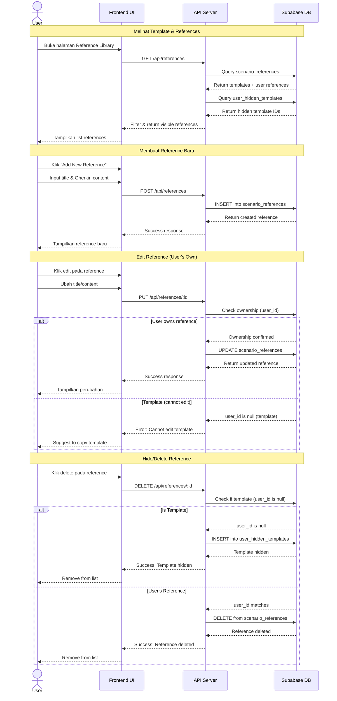
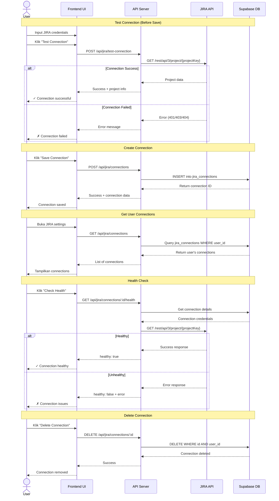
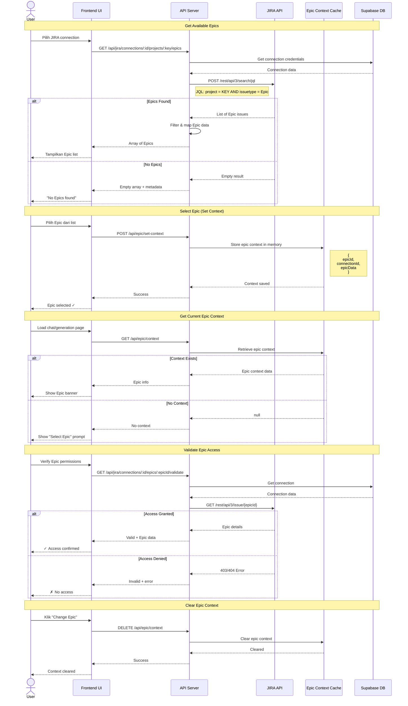
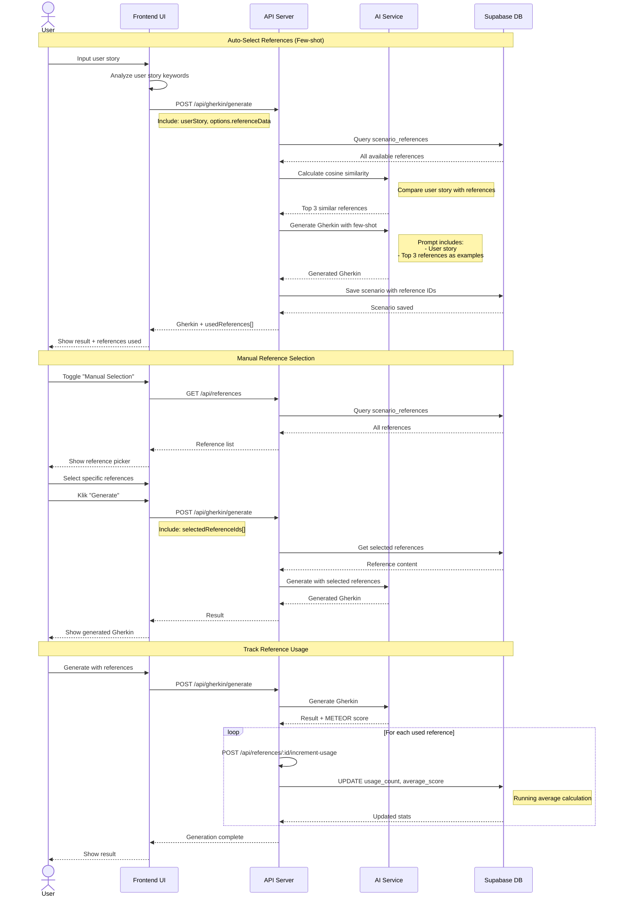
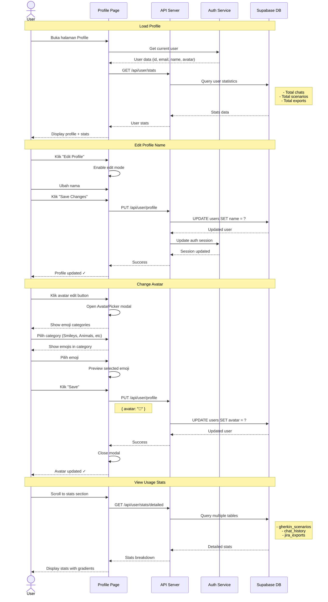
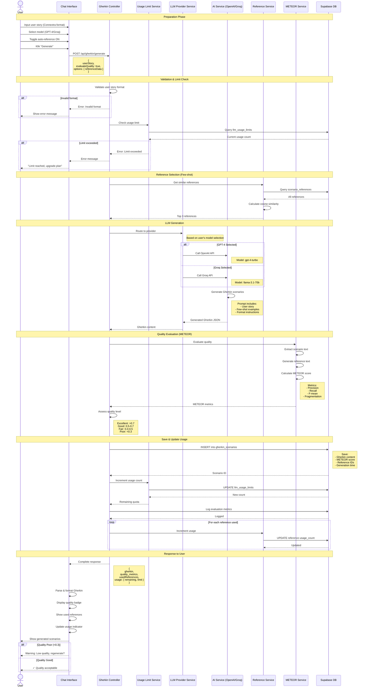

# Sequence Diagram - Aplikasi SpecWeave

Dokumentasi sequence diagram untuk fitur-fitur utama aplikasi SpecWeave.

## 1. Manajemen Template User Story

## 2. Koneksi JIRA Project

## 3. Pemilihan Epic JIRA

## 4. Manajemen Reference Library / Few-shot

## 5. Manajemen Profile

## 6. Generasi Output (KRUSIAL)

## 7. Export JIRA (KRUSIAL)

```mermaid
sequenceDiagram
    actor User
    participant UI as Chat Interface
    participant Export as JiraStoryService
    participant API as JIRA Controller
    participant JIRA as JIRA API
    participant Epic as Epic Service
    participant DB as Supabase DB
    
    Note over User,DB: Pre-Export Validation
    User->>UI: Klik "Export to JIRA"
    UI->>UI: Validate story data
    
    alt No Epic Selected
        UI-->>User: Error: "Select Epic first"
    end
    
    UI->>Export: validateStoryData()
    Export->>Export: Check required fields
    alt Validation Failed
        Export-->>UI: Validation errors[]
        UI-->>User: Show error messages
    end
    
    Note over User,DB: Get Epic Context
    UI->>API: GET /api/epic/context
    API->>Epic: getEpicContext(userId)
    Epic->>Epic: Retrieve from cache
    Epic-->>API: Epic data + connection
    API-->>UI: Epic context
    
    Note over User,DB: Create User Story
    UI->>Export: createCompleteStory()
    Export->>API: POST /api/jira/connections/:id/epics/:epicId/complete-story
    Note right of Export: {<br/>  storyData,<br/>  scenarios,<br/>  developmentTasks<br/>}
    
    API->>DB: Get JIRA connection
    DB-->>API: Connection credentials
    
    API->>API: Format story for JIRA
    Note right of API: Convert to ADF format
    
    API->>JIRA: POST /rest/api/3/issue
    Note right of JIRA: Create Story issue
    
    alt Story Creation Failed
        JIRA-->>API: Error (400/403/500)
        API-->>Export: Error details
        Export-->>UI: Creation failed
        UI-->>User: ✗ Export failed
    end
    
    JIRA-->>API: Story created (ID, Key)
    
    Note over User,DB: Link Story to Epic
    API->>JIRA: GET /rest/api/3/issue/{epicId}
    JIRA-->>API: Epic key
    
    API->>JIRA: GET /rest/api/3/field
    JIRA-->>API: Field definitions
    API->>API: Find Epic Link field ID
    
    API->>JIRA: PUT /rest/api/3/issue/{storyId}
    Note right of JIRA: Set Epic Link or parent field
    
    alt Link Failed
        JIRA-->>API: Error
        API->>API: Log warning (continue)
    else Link Success
        JIRA-->>API: Story linked
    end
    
    Note over User,DB: Create Subtasks (Scenarios)
    loop For each scenario
        API->>API: Format scenario as subtask
        Note right of API: {<br/>  summary: scenario.title,<br/>  description: steps (ADF),<br/>  parent: storyId<br/>}
        
        API->>JIRA: POST /rest/api/3/issue
        Note right of JIRA: Create Subtask
        
        alt Subtask Created
            JIRA-->>API: Subtask ID, Key
            API->>API: Add to subtasks[]
        else Subtask Failed
            JIRA-->>API: Error
            API->>API: Log error, continue
        end
    end
    
    Note over User,DB: Create Development Tasks (Optional)
    alt Has Development Tasks
        loop For each dev task
            API->>API: Format as subtask
            API->>JIRA: POST /rest/api/3/issue
            JIRA-->>API: Task created
        end
    end
    
    Note over User,DB: Update Database
    API->>DB: UPDATE gherkin_scenarios
    Note right of DB: Set:<br/>- jira_user_story_id<br/>- jira_epic_id<br/>- jira_subtask_ids[]
    DB-->>API: Updated
    
    API->>DB: INSERT into jira_export_history
    Note right of DB: Log export:<br/>- User ID<br/>- Story key<br/>- Epic key<br/>- Timestamp
    DB-->>API: Export logged
    
    Note over User,DB: Response to User
    API-->>Export: Export result
    Note right of API: {<br/>  user_story: { id, key, url },<br/>  scenarios: [{ id, key, url }],<br/>  total_scenarios<br/>}
    
    Export-->>UI: Success response
    UI->>UI: Show success notification
    UI->>UI: Display JIRA links
    UI-->>User: ✓ Exported successfully
    
    UI-->>User: Show clickable links:
    Note right of UI: - User Story: PROJ-123<br/>- Scenarios: PROJ-124, PROJ-125<br/>- Epic: PROJ-100
    
    Note over User,DB: Error Handling & Retry
    alt Export Failed
        Export-->>UI: Error details
        UI-->>User: Show error + retry option
        
        User->>UI: Klik "Retry"
        UI->>Export: Retry with exponential backoff
        Export->>API: Retry request
        Note right of Export: Progressive timeout:<br/>Attempt 1: 15s<br/>Attempt 2: 30s<br/>Attempt 3: 45s
    end
```

## Catatan Implementasi

### Teknologi yang Digunakan:
- **Frontend**: React + Vite
- **Backend**: Node.js + Express
- **Database**: Supabase (PostgreSQL)
- **AI**: OpenAI GPT-4 / Groq Llama
- **JIRA**: REST API v3
- **Quality**: METEOR metrics

### Fitur Keamanan:
- Authentication middleware pada semua endpoint sensitif
- Ownership validation untuk user resources
- JIRA credential encryption
- Rate limiting pada AI generation

### Performance Optimization:
- Epic context caching (in-memory)
- Reference similarity pre-calculation
- Progressive timeout untuk JIRA operations
- Batch operations untuk multiple exports

---

**Dibuat untuk**: Aplikasi SpecWeave
**Tanggal**: 2026-04-26
**Versi**: 1.0
