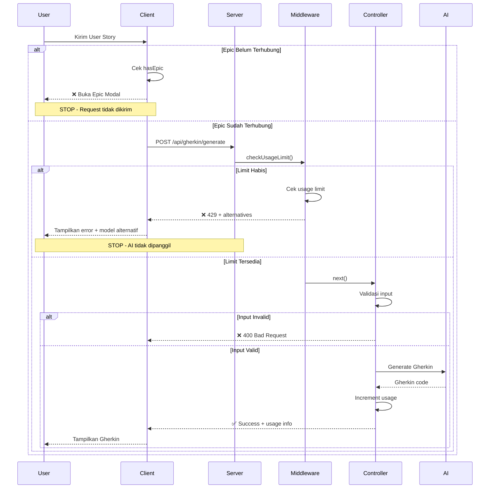

# Urutan Validasi Saat User Mengirim User Story

## Pertanyaan
**KETIKA PENGGUNA MENGIRIM INPUT USER STORY, NAMUN JIRA DAN EPIC BELUM TERHUBUNG, KEMUDIAN LIMIT MODEL JUGA SUDAH HABIS. YANG MANA DULU YANG AKAN DI CEK?**

## ⚠️ KOREKSI: **TIDAK ADA VALIDASI EPIC DI SERVER!**

**Jawaban yang Benar:**
1. **EPIC** dicek di **CLIENT-SIDE** saja (opsional untuk chat baru)
2. **LIMIT MODEL** dicek di **SERVER-SIDE** (middleware)
3. **TIDAK ADA** validasi Epic di server untuk endpoint `/api/gherkin/generate`

---

## Alur Validasi Lengkap (YANG BENAR)

```
┌─────────────────────────────────────────────────────────────┐
│  User mengirim User Story di ChatRefined.jsx                │
└────────────────────────┬────────────────────────────────────┘
                         │
                         ▼
┌─────────────────────────────────────────────────────────────┐
│  VALIDASI 1: CEK EPIC CONTEXT (CLIENT-SIDE) - OPSIONAL      │
│  Location: aplikasi-klien/src/pages/ChatRefined.jsx         │
│  Function: handleSendMessage()                               │
│  Line: 601-604                                               │
├─────────────────────────────────────────────────────────────┤
│  if (!activeChatId && !hasEpic) {                           │
│    setRequiresEpicSelection(true);                          │
│    openEpicModal();                                          │
│    return; // ❌ STOP DI SINI (hanya untuk chat baru)       │
│  }                                                           │
│                                                              │
│  ⚠️ CATATAN: Validasi ini HANYA untuk chat baru             │
│  Jika sudah ada activeChatId, Epic tidak dicek!             │
└────────────────────────┬────────────────────────────────────┘
                         │
                         │ ✅ Lanjut ke server (dengan/tanpa Epic)
                         ▼
┌─────────────────────────────────────────────────────────────┐
│  Request dikirim ke Server                                   │
│  POST /api/gherkin/generate                                  │
│  Middleware: optionalAuth → checkUsageLimit → controller    │
└────────────────────────┬────────────────────────────────────┘
                         │
                         ▼
┌─────────────────────────────────────────────────────────────┐
│  VALIDASI 2: CEK USAGE LIMIT (SERVER-SIDE)                  │
│  Location: aplikasi-server/src/middleware/                  │
│            usageLimitMiddleware.js                           │
│  Function: checkUsageLimit()                                 │
│  Line: 27-65                                                 │
├─────────────────────────────────────────────────────────────┤
│  1. Skip jika anonymous user                                │
│  2. Extract model dari request body                         │
│  3. Call usageLimitService.checkLimit()                     │
│  4. Jika limit habis:                                       │
│     return 429 dengan alternatives ❌ STOP DI SINI          │
│  5. Jika allowed:                                           │
│     req.usageLimit = limitCheck                             │
│     next() ✅                                               │
└────────────────────────┬────────────────────────────────────┘
                         │
                         │ ✅ Limit tersedia
                         ▼
┌─────────────────────────────────────────────────────────────┐
│  VALIDASI 3: VALIDASI INPUT (SERVER-SIDE)                   │
│  Location: aplikasi-server/src/controllers/                 │
│            gherkinController.js                              │
│  Function: generateGherkin()                                 │
│  Line: 26-30                                                 │
├─────────────────────────────────────────────────────────────┤
│  - User story required dan harus string                     │
│  - Minimal 10 karakter                                      │
│                                                              │
│  ⚠️ TIDAK ADA validasi Epic di sini!                        │
└────────────────────────┬────────────────────────────────────┘
                         │
                         │ ✅ Input valid
                         ▼
┌─────────────────────────────────────────────────────────────┐
│  PROSES AI: Generate Gherkin                                 │
│  - Panggil convertToGherkin()                               │
│  - Gunakan model yang dipilih user                          │
│  - Increment usage counter setelah sukses                   │
│  - Epic context OPSIONAL (hanya untuk save ke DB)           │
└────────────────────────┬────────────────────────────────────┘
                         │
                         ▼
┌─────────────────────────────────────────────────────────────┐
│  Response dikirim ke Client                                  │
│  - Gherkin code                                              │
│  - Usage info (model, remaining, limit)                     │
│  - Quality metrics (jika diminta)                           │
└─────────────────────────────────────────────────────────────┘
```

---

## Detail Setiap Validasi

### 1️⃣ VALIDASI EPIC (CLIENT-SIDE) - **OPSIONAL, HANYA UNTUK CHAT BARU**

**Location:** `aplikasi-klien/src/pages/ChatRefined.jsx`  
**Function:** `handleSendMessage()`  
**Line:** 601-604

```javascript
if (!activeChatId && !hasEpic) {
  setRequiresEpicSelection(true);
  openEpicModal();
  return; // ❌ STOP - Request tidak dikirim ke server
}
```

**Kondisi:**
- Jika tidak ada `activeChatId` (chat baru)
- **DAN** tidak ada `hasEpic` (Epic belum dipilih)

**⚠️ PENTING:**
- Validasi ini **HANYA** untuk chat baru
- Jika sudah ada `activeChatId`, Epic **TIDAK DICEK**
- User bisa mengirim user story **TANPA Epic** jika sudah ada chat aktif

**Action:**
- Buka modal Epic selection
- **STOP** - Request **TIDAK DIKIRIM** ke server

**Alasan:**
- UX requirement untuk chat baru
- Epic **OPSIONAL** untuk generate Gherkin
- Epic hanya diperlukan untuk JIRA integration (save ke DB)

---

### 2️⃣ VALIDASI USAGE LIMIT (SERVER-SIDE) - **WAJIB UNTUK AUTHENTICATED USER**

**Location:** `aplikasi-server/src/middleware/usageLimitMiddleware.js`  
**Function:** `checkUsageLimit()`  
**Line:** 27-65

```javascript
export const checkUsageLimit = async (req, res, next) => {
  // Skip untuk anonymous users
  if (!req.user?.id) {
    return next();
  }

  try {
    const modelName = req.body.model || 'llama-3.1-8b-instant';
    
    // Cek limit
    const limitCheck = await usageLimitService.checkLimit(req.user.id, modelName);

    // Jika limit habis
    if (!limitCheck.allowed) {
      return res.status(429).json({
        success: false,
        error: {
          code: 'USAGE_LIMIT_EXCEEDED',
          message: `Batas request tercapai untuk model ${limitCheck.displayName}`,
          alternatives: limitCheck.alternatives, // Model alternatif
        },
      });
    }

    // Jika allowed, lanjutkan
    req.usageLimit = limitCheck;
    next();
  } catch (error) {
    next(error);
  }
};
```

**Kondisi:**
- User sudah authenticated
- Model yang dipilih sudah mencapai limit

**Action:**
- Return HTTP 429 (Too Many Requests)
- Berikan daftar model alternatif yang masih punya quota
- **STOP** - Request tidak dilanjutkan ke controller

**Alasan:**
- Validasi di middleware sebelum controller
- Mencegah pemrosesan AI yang mahal jika limit habis
- Memberikan feedback langsung dengan alternatif model
- **INI ADALAH VALIDASI UTAMA** yang selalu dicek untuk authenticated user

---

### 3️⃣ VALIDASI INPUT (CONTROLLER) - **KETIGA**

**Location:** `aplikasi-server/src/controllers/gherkinController.js`  
**Function:** `generateGherkin()`  
**Line:** 23-30

```javascript
// Validasi input
if (!userStory || typeof userStory !== 'string') {
  throw new AppError('User story is required and must be a string', 400);
}
if (userStory.trim().length < 10) {
  throw new AppError('User story must be at least 10 characters (too short)', 400);
}
```

**Kondisi:**
- User story kosong atau bukan string
- User story terlalu pendek (< 10 karakter)

**Action:**
- Throw error 400 (Bad Request)
- **STOP** - Tidak panggil AI

---

## Kesimpulan

### ⚠️ KOREKSI PENTING:

**Diagram yang ditunjukkan TIDAK SEPENUHNYA BENAR!**

### Urutan Pengecekan yang BENAR:

1. **EPIC CONTEXT** (client-side) ← **OPSIONAL** (hanya untuk chat baru)
2. **USAGE LIMIT** (server middleware) ← **WAJIB** (untuk authenticated user)
3. **INPUT VALIDATION** (server controller) ← **WAJIB**
4. **AI PROCESSING** (jika semua validasi lolos)

### Perbedaan dengan Diagram:

❌ **SALAH di Diagram:**
- Diagram menunjukkan Epic **WAJIB** dicek dulu
- Diagram menunjukkan ada validasi Epic di server

✅ **YANG BENAR:**
- Epic **OPSIONAL**, hanya dicek untuk chat baru di client
- **TIDAK ADA** validasi Epic di server untuk endpoint `/api/gherkin/generate`
- Epic hanya diperlukan untuk JIRA integration (save ke DB), bukan untuk generate Gherkin
- User bisa generate Gherkin **TANPA Epic** jika sudah ada chat aktif

### Alasan Urutan Ini:

#### Epic (Opsional):
- ✅ Hanya untuk UX chat baru
- ✅ Tidak blocking untuk generate Gherkin
- ✅ Epic hanya untuk JIRA integration
- ✅ User bisa skip Epic dan tetap generate Gherkin

#### Limit (Wajib untuk authenticated user):
- ✅ Validasi di middleware (sebelum controller)
- ✅ Mencegah pemrosesan AI yang mahal
- ✅ Memberikan alternatif model langsung
- ✅ Ini adalah constraint teknis yang harus dicek

---

## Skenario Konkret

### Skenario 1: User mengirim User Story di CHAT BARU, Epic belum terhubung DAN limit habis

```
User: "As a user, I want to login" (di chat baru)
      ↓
[CLIENT] Cek activeChatId? ❌ Tidak ada (chat baru)
[CLIENT] Cek hasEpic? ❌ Tidak ada
      ↓
[CLIENT] Buka Epic Modal
      ↓
❌ STOP - Request tidak dikirim ke server
```

**Limit tidak dicek** karena request tidak sampai ke server.

---

### Skenario 2: User mengirim User Story di CHAT YANG SUDAH ADA, Epic belum terhubung, limit habis

```
User: "As a user, I want to login" (di chat existing)
      ↓
[CLIENT] Cek activeChatId? ✅ Ada (chat existing)
[CLIENT] Skip cek Epic (karena ada activeChatId)
      ↓
[CLIENT] Kirim request ke server
      ↓
[SERVER] Middleware: Cek limit? ❌ Habis
      ↓
[SERVER] Return 429 dengan alternatives
      ↓
❌ STOP - AI tidak dipanggil
```

**Epic tidak dicek** karena sudah ada activeChatId.
**Limit dicek** dan ternyata habis.

---

### Skenario 3: User mengirim User Story di CHAT BARU, Epic ada, limit habis

```
User: "As a user, I want to login" (di chat baru)
      ↓
[CLIENT] Cek activeChatId? ❌ Tidak ada (chat baru)
[CLIENT] Cek hasEpic? ✅ Ada
      ↓
[CLIENT] Buat chat baru
[CLIENT] Kirim request ke server
      ↓
[SERVER] Middleware: Cek limit? ❌ Habis
      ↓
[SERVER] Return 429 dengan alternatives
      ↓
❌ STOP - AI tidak dipanggil
```

**Epic ada**, jadi lanjut ke server.
**Limit dicek** dan ternyata habis.

---

### Skenario 4: Epic ada DAN limit tersedia

```
User: "As a user, I want to login"
      ↓
[CLIENT] Cek Epic? ✅ Ada (atau skip karena ada activeChatId)
      ↓
[CLIENT] Kirim request ke server
      ↓
[SERVER] Middleware: Cek limit? ✅ Tersedia
      ↓
[SERVER] Controller: Validasi input? ✅ Valid
      ↓
[SERVER] Panggil AI untuk generate Gherkin
      ↓
[SERVER] Increment usage counter
      ↓
[SERVER] Save ke DB (dengan Epic jika ada)
      ↓
✅ SUCCESS - Return Gherkin + usage info
```

---

## Rekomendasi UX

### Jika Epic Belum Terhubung:
```
┌─────────────────────────────────────────┐
│  ⚠️  Epic Belum Dipilih                 │
│                                          │
│  Silakan pilih Epic terlebih dahulu     │
│  untuk melanjutkan.                     │
│                                          │
│  [Pilih Epic]  [Batal]                  │
└─────────────────────────────────────────┘
```

### Jika Limit Habis:
```
┌─────────────────────────────────────────┐
│  ⚠️  Limit Model Tercapai               │
│                                          │
│  Model: Llama 3.1 8B (Economy)          │
│  Limit: 100/100 request                 │
│                                          │
│  Model alternatif tersedia:             │
│  • Llama 3.1 70B (Standard) - 50 left   │
│  • GPT-4 (Premium) - 10 left            │
│                                          │
│  [Ganti Model]  [Batal]                 │
└─────────────────────────────────────────┘
```

---

## Kode Referensi

### Client-Side Epic Check
**File:** `aplikasi-klien/src/pages/ChatRefined.jsx`
```javascript
const handleSendMessage = async (text) => {
  // VALIDASI 1: Epic Context
  if (!activeChatId && !hasEpic) {
    setRequiresEpicSelection(true);
    openEpicModal();
    return; // STOP
  }
  
  // Lanjut kirim ke server...
  sendMessage(text, { 
    epicContext: epicContext,
    chatId: currentId,
    model: selectedModel,
    // ...
  });
};
```

### Server-Side Limit Check
**File:** `aplikasi-server/src/middleware/usageLimitMiddleware.js`
```javascript
export const checkUsageLimit = async (req, res, next) => {
  if (!req.user?.id) return next();
  
  const modelName = req.body.model || 'llama-3.1-8b-instant';
  const limitCheck = await usageLimitService.checkLimit(req.user.id, modelName);
  
  // VALIDASI 2: Usage Limit
  if (!limitCheck.allowed) {
    return res.status(429).json({
      error: {
        code: 'USAGE_LIMIT_EXCEEDED',
        alternatives: limitCheck.alternatives
      }
    });
  }
  
  req.usageLimit = limitCheck;
  next();
};
```

### Route Configuration
**File:** `aplikasi-server/src/routes/gherkinRoutes.js`
```javascript
// Urutan middleware: optionalAuth → checkUsageLimit → generateGherkin
router.post('/generate', optionalAuth, checkUsageLimit, generateGherkin);
```

---

## Diagram Sequence



---

## Summary

| Validasi | Lokasi | Urutan | Status | Alasan |
|----------|--------|--------|--------|--------|
| **Epic Context** | Client-side | **1️⃣** | **OPSIONAL** | Hanya untuk chat baru, tidak blocking untuk generate Gherkin |
| **Usage Limit** | Server middleware | **2️⃣** | **WAJIB** (authenticated) | Mencegah AI call yang mahal, bisa kasih alternatif |
| **Input Validation** | Server controller | **3️⃣** | **WAJIB** | Validasi data sebelum AI processing |
| **AI Processing** | Server controller | **4️⃣** | - | Hanya jika semua validasi lolos |

### ⚠️ PENTING - Perbedaan dengan Diagram:

**Diagram menunjukkan:**
- Epic **WAJIB** dicek dulu sebelum limit
- Ada validasi Epic di server

**Kenyataannya:**
- Epic **OPSIONAL**, hanya dicek untuk chat baru
- **TIDAK ADA** validasi Epic di server untuk `/api/gherkin/generate`
- User bisa generate Gherkin **TANPA Epic**
- Epic hanya diperlukan untuk JIRA integration (save ke DB)

**Jawaban untuk pertanyaan awal:**
- Jika di **chat baru**: Epic dicek dulu (client), lalu limit (server)
- Jika di **chat existing**: Epic **TIDAK DICEK**, langsung limit (server)
- Epic **TIDAK BLOCKING** untuk generate Gherkin
