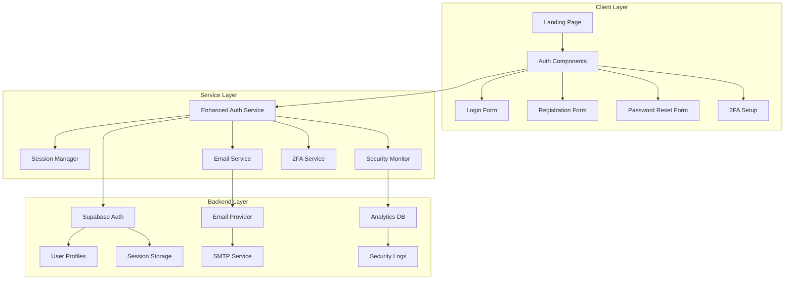
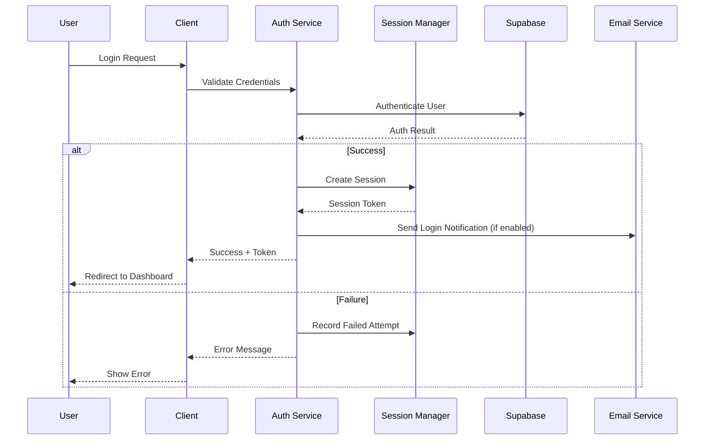

# Design Document: Enhanced Login System

## Overview

The Enhanced Login System builds upon the existing SpecWeave authentication infrastructure to provide a more secure, user-friendly, and comprehensive authentication experience. The design focuses on improving security through multi-layered protection, enhancing user experience with modern authentication flows, and providing administrators with better monitoring capabilities.

The system will integrate seamlessly with the existing Supabase authentication backend while adding new features like email verification, two-factor authentication, enhanced session management, and comprehensive security monitoring.

## Architecture

### High-Level Architecture



### Component Interaction Flow



## Components and Interfaces

### 1. Enhanced Authentication Service

**Purpose**: Central service managing all authentication operations with enhanced security features.

**Key Methods**:
```typescript
interface EnhancedAuthService {
  // Core Authentication
  signInWithCredentials(email: string, password: string): Promise<AuthResult>
  signUpWithVerification(userData: UserRegistration): Promise<AuthResult>
  signOut(): Promise<void>
  
  // Password Management
  initiatePasswordReset(email: string): Promise<void>
  completePasswordReset(token: string, newPassword: string): Promise<AuthResult>
  changePassword(currentPassword: string, newPassword: string): Promise<AuthResult>
  
  // Email Verification
  sendVerificationEmail(userId: string): Promise<void>
  verifyEmail(token: string): Promise<AuthResult>
  
  // Two-Factor Authentication
  enable2FA(): Promise<TwoFactorSetup>
  verify2FA(code: string): Promise<AuthResult>
  disable2FA(password: string): Promise<void>
  generateBackupCodes(): Promise<string[]>
  
  // Social Authentication
  signInWithGoogle(): Promise<AuthResult>
  signInWithGitHub(): Promise<AuthResult>
  linkSocialAccount(provider: string): Promise<void>
  
  // Security
  checkAccountLockout(email: string): Promise<LockoutStatus>
  recordLoginAttempt(email: string, success: boolean, metadata: LoginMetadata): Promise<void>
}
```

### 2. Session Manager

**Purpose**: Manages user sessions with enhanced security and monitoring.

**Key Methods**:
```typescript
interface SessionManager {
  createSession(userId: string, options: SessionOptions): Promise<Session>
  validateSession(token: string): Promise<SessionValidation>
  refreshSession(token: string): Promise<Session>
  invalidateSession(token: string): Promise<void>
  invalidateAllSessions(userId: string, exceptCurrent?: string): Promise<void>
  
  // Session Monitoring
  getActiveSessions(userId: string): Promise<Session[]>
  detectAnomalousActivity(userId: string): Promise<SecurityAlert[]>
  recordSessionActivity(sessionId: string, activity: ActivityType): Promise<void>
}
```

### 3. Security Monitor

**Purpose**: Monitors authentication activities and detects security threats.

**Key Methods**:
```typescript
interface SecurityMonitor {
  recordLoginAttempt(attempt: LoginAttempt): Promise<void>
  checkBruteForce(identifier: string): Promise<ThreatLevel>
  detectLocationAnomaly(userId: string, location: GeoLocation): Promise<boolean>
  generateSecurityAlert(userId: string, alertType: AlertType): Promise<void>
  getSecurityReport(timeRange: TimeRange): Promise<SecurityReport>
  
  // Account Protection
  lockAccount(userId: string, duration: number, reason: string): Promise<void>
  unlockAccount(userId: string): Promise<void>
  isAccountLocked(userId: string): Promise<LockoutStatus>
}
```

### 4. Email Service

**Purpose**: Handles all email communications for authentication flows.

**Key Methods**:
```typescript
interface EmailService {
  sendVerificationEmail(email: string, token: string): Promise<void>
  sendPasswordResetEmail(email: string, token: string): Promise<void>
  sendSecurityAlert(email: string, alertData: SecurityAlertData): Promise<void>
  sendLoginNotification(email: string, loginData: LoginNotificationData): Promise<void>
  sendWelcomeEmail(email: string, userData: UserData): Promise<void>
}
```

### 5. Two-Factor Authentication Service

**Purpose**: Manages 2FA setup, verification, and recovery.

**Key Methods**:
```typescript
interface TwoFactorService {
  generateSecret(userId: string): Promise<TwoFactorSecret>
  verifySetup(userId: string, code: string): Promise<boolean>
  verifyCode(userId: string, code: string): Promise<boolean>
  generateBackupCodes(userId: string): Promise<string[]>
  verifyBackupCode(userId: string, code: string): Promise<boolean>
  disable2FA(userId: string): Promise<void>
}
```

## Data Models

### User Profile (Enhanced)

```typescript
interface UserProfile {
  id: string
  email: string
  name: string
  avatar_url?: string
  role: 'user' | 'admin' | 'moderator'
  
  // Enhanced fields
  email_verified: boolean
  email_verified_at?: Date
  two_factor_enabled: boolean
  two_factor_secret?: string
  backup_codes?: string[]
  
  // Security tracking
  last_login_at?: Date
  last_login_ip?: string
  last_login_location?: GeoLocation
  failed_login_attempts: number
  account_locked_until?: Date
  
  // Preferences
  login_notifications_enabled: boolean
  security_alerts_enabled: boolean
  remember_me_enabled: boolean
  
  // Timestamps
  created_at: Date
  updated_at: Date
}
```

### Session Model

```typescript
interface Session {
  id: string
  user_id: string
  token: string
  refresh_token?: string
  
  // Session metadata
  device_info: DeviceInfo
  ip_address: string
  location?: GeoLocation
  user_agent: string
  
  // Session control
  expires_at: Date
  last_activity_at: Date
  is_remember_me: boolean
  
  // Security
  is_suspicious: boolean
  security_flags: string[]
  
  created_at: Date
}
```

### Login Attempt Model

```typescript
interface LoginAttempt {
  id: string
  email: string
  user_id?: string
  
  // Attempt details
  success: boolean
  failure_reason?: string
  ip_address: string
  user_agent: string
  location?: GeoLocation
  
  // Security analysis
  is_suspicious: boolean
  threat_level: 'low' | 'medium' | 'high'
  security_flags: string[]
  
  attempted_at: Date
}
```

### Security Alert Model

```typescript
interface SecurityAlert {
  id: string
  user_id: string
  alert_type: 'suspicious_login' | 'new_device' | 'location_anomaly' | 'brute_force' | 'account_locked'
  severity: 'info' | 'warning' | 'critical'
  
  // Alert data
  title: string
  description: string
  metadata: Record<string, any>
  
  // Status
  is_resolved: boolean
  resolved_at?: Date
  resolved_by?: string
  
  created_at: Date
}
```

## Error Handling

### Error Types and Responses

```typescript
enum AuthErrorType {
  INVALID_CREDENTIALS = 'invalid_credentials',
  ACCOUNT_LOCKED = 'account_locked',
  EMAIL_NOT_VERIFIED = 'email_not_verified',
  TWO_FACTOR_REQUIRED = 'two_factor_required',
  INVALID_TWO_FACTOR = 'invalid_two_factor',
  PASSWORD_TOO_WEAK = 'password_too_weak',
  EMAIL_ALREADY_EXISTS = 'email_already_exists',
  INVALID_RESET_TOKEN = 'invalid_reset_token',
  RESET_TOKEN_EXPIRED = 'reset_token_expired',
  SESSION_EXPIRED = 'session_expired',
  RATE_LIMITED = 'rate_limited',
  SUSPICIOUS_ACTIVITY = 'suspicious_activity'
}

interface AuthError {
  type: AuthErrorType
  message: string
  details?: Record<string, any>
  retryAfter?: number
  suggestions?: string[]
}
```

### Error Handling Strategy

1. **Graceful Degradation**: System continues to function with reduced features when non-critical components fail
2. **User-Friendly Messages**: Technical errors are translated to user-understandable messages
3. **Security-First**: Error messages don't leak sensitive information
4. **Recovery Guidance**: Errors include actionable steps for users to resolve issues
5. **Logging**: All errors are logged with appropriate detail levels for debugging

## Testing Strategy

### Unit Testing Approach

**Core Authentication Logic**:
- Test credential validation with various input combinations
- Test password strength requirements and validation
- Test email format validation and normalization
- Test session token generation and validation
- Test 2FA code generation and verification

**Security Features**:
- Test account lockout mechanisms with different failure scenarios
- Test rate limiting with various request patterns
- Test suspicious activity detection algorithms
- Test session expiration and cleanup processes

**Integration Points**:
- Test Supabase authentication integration
- Test email service integration with different providers
- Test social login flows with OAuth providers
- Test database operations for user profiles and sessions

### Property-Based Testing

Property-based tests will validate universal behaviors across all authentication scenarios:

**Authentication Properties**:
- For any valid user credentials, authentication should succeed consistently
- For any invalid credentials, authentication should fail securely
- For any session token, validation should be deterministic
- For any password reset flow, security tokens should be unique and time-limited

**Security Properties**:
- For any sequence of failed login attempts, lockout thresholds should be enforced
- For any suspicious activity pattern, appropriate alerts should be generated
- For any session, expiration should be enforced consistently
- For any 2FA setup, backup codes should provide reliable recovery

**Session Management Properties**:
- For any active session, user permissions should be consistent
- For any expired session, access should be denied
- For any session invalidation, all related tokens should be revoked
- For any concurrent sessions, each should maintain independent state

### Integration Testing

**End-to-End Authentication Flows**:
- Complete registration with email verification
- Password reset with email confirmation
- Social login with account linking
- 2FA setup and login verification
- Session management across multiple devices

**Security Scenario Testing**:
- Brute force attack simulation
- Concurrent login attempt handling
- Session hijacking prevention
- Cross-site request forgery protection

### Performance Testing

**Load Testing Scenarios**:
- Concurrent login attempts (target: 1000 concurrent users)
- Session validation under load (target: <100ms response time)
- Password reset email delivery (target: <5 seconds)
- 2FA verification performance (target: <200ms)

**Stress Testing**:
- Database connection limits during peak authentication
- Email service rate limits and queuing
- Memory usage during session management
- CPU usage during password hashing operations

## Correctness Properties

*A property is a characteristic or behavior that should hold true across all valid executions of a system-essentially, a formal statement about what the system should do. Properties serve as the bridge between human-readable specifications and machine-verifiable correctness guarantees.*

### Property 1: Password Reset Security Flow
*For any* valid email address, initiating a password reset should generate a unique, time-limited token that allows password change within 15 minutes and becomes invalid afterward
**Validates: Requirements 1.2, 1.3, 1.4, 1.5**

### Property 2: Password Reset Security Protection
*For any* invalid email address, password reset requests should return a generic success message without revealing account existence
**Validates: Requirements 1.6**

### Property 3: Email Verification Lifecycle
*For any* user registration, the system should send a verification email with a 24-hour expiration token that activates the account when clicked and can be regenerated on request
**Validates: Requirements 2.1, 2.2, 2.4, 2.5**

### Property 4: Unverified User Login Behavior
*For any* unverified user attempting login, the system should allow access but display verification reminders consistently
**Validates: Requirements 2.3**

### Property 5: Session Creation and Management
*For any* successful login, the system should create a secure session with appropriate expiration (24 hours default, 30 days with "Remember Me")
**Validates: Requirements 3.1, 3.2, 3.3**

### Property 6: Session Invalidation Rules
*For any* user logout or password change, the system should immediately invalidate the current session (logout) or all other sessions (password change)
**Validates: Requirements 3.5, 3.6**

### Property 7: New Device Detection and Notification
*For any* login from an unrecognized device, the system should optionally send email notifications based on user preferences
**Validates: Requirements 3.4**

### Property 8: Account Lockout Protection
*For any* sequence of 5 consecutive failed login attempts, the system should lock the account for 15 minutes and reset the counter on successful login
**Validates: Requirements 4.1, 4.2, 4.3**

### Property 9: Security Alert Generation
*For any* suspicious login activity or unrecognized location, the system should generate appropriate security alerts and notifications
**Validates: Requirements 4.4, 4.5**

### Property 10: Two-Factor Authentication Setup
*For any* user enabling 2FA, the system should generate a unique secret and QR code for authenticator app configuration
**Validates: Requirements 5.1**

### Property 11: Two-Factor Authentication Verification
*For any* 2FA-enabled user login, the system should require valid 6-digit codes and lock accounts after 3 invalid attempts
**Validates: Requirements 5.2, 5.3, 5.4**

### Property 12: Two-Factor Authentication Recovery
*For any* user losing 2FA access, the system should provide backup codes as a recovery mechanism
**Validates: Requirements 5.5**

### Property 13: Social Login Account Management
*For any* successful social login, the system should create new accounts or link existing accounts based on email matching
**Validates: Requirements 6.3, 6.4**

### Property 14: Social Login Error Handling
*For any* failed social login attempt, the system should display appropriate error messages and provide fallback authentication options
**Validates: Requirements 6.5**

### Property 15: Comprehensive Login Logging
*For any* login attempt (successful or failed), the system should log complete metadata including timestamp, IP address, user agent, and location data
**Validates: Requirements 7.1, 7.2, 7.3**

### Property 16: Security Analytics and Reporting
*For any* abnormal login patterns or administrator report requests, the system should generate comprehensive analytics and security alerts
**Validates: Requirements 7.4, 7.5**

### Property 17: Mobile Interface Adaptation
*For any* mobile device access, the system should provide optimized interfaces that adapt to device orientation and maintain state during app lifecycle events
**Validates: Requirements 8.1, 8.3, 8.5**

### Property 18: Network Condition Handling
*For any* slow network conditions, the system should provide appropriate loading indicators and maintain functionality
**Validates: Requirements 8.4**

### Property 19: Google OAuth Signup Verification
*For any* user attempting Google OAuth sign-in without prior database registration, the system should verify user existence and reject unauthorized access
**Validates: Requirements 9.1, 9.2**

### Property 20: Google OAuth Profile Creation
*For any* successful Google OAuth signup, the system should create a profile record in the database and allow subsequent sign-ins with the same account
**Validates: Requirements 9.4, 9.5**

### Property 21: Authentication Mode Enforcement
*For any* authentication attempt, the system should enforce different validation rules based on signup vs signin mode detection
**Validates: Requirements 9.6**

### Example Tests

**Example 1: Forgot Password UI Flow**
When a user clicks the "Forgot Password" link on the login page, the system should display the password reset form
**Validates: Requirements 1.1**

**Example 2: Google OAuth Redirect**
When a user clicks "Login with Google", the system should redirect to the Google OAuth authorization flow
**Validates: Requirements 6.1**

**Example 3: GitHub OAuth Redirect**
When a user clicks "Login with GitHub", the system should redirect to the GitHub OAuth authorization flow
**Validates: Requirements 6.2**

**Example 4: Biometric Authentication Support**
When biometric authentication is available on the device, the system should support fingerprint or face recognition login
**Validates: Requirements 8.2**

**Example 5: Google OAuth Rejection Message**
When a Google OAuth user is rejected due to non-registration, the system should display a clear message requiring signup first
**Validates: Requirements 9.3**