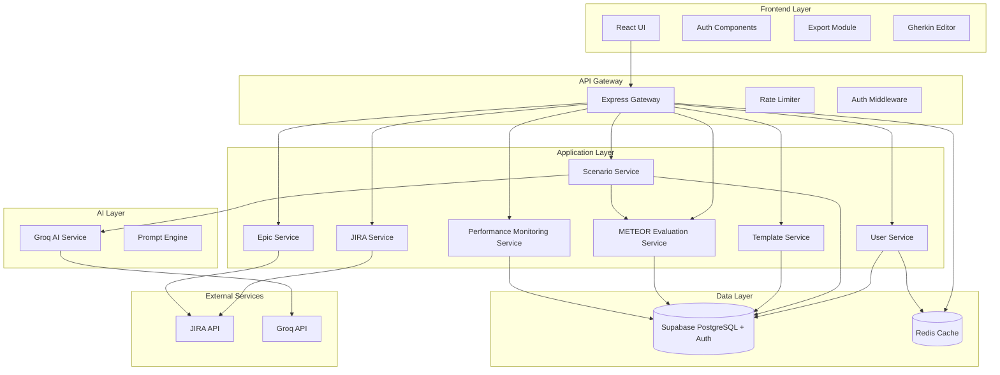

# Design Document - SpecWeave Enhancement

## Overview

This design document outlines the architecture and implementation approach for enhancing the SpecWeave application with advanced features including export capabilities, user authentication, template management, JIRA integration, and API access. The design maintains the current AI-powered core functionality while adding enterprise-grade features for team collaboration and workflow integration.

## Architecture

### High-Level Architecture



### Component Architecture

#### Frontend Components
```
src/
├── components/
│   ├── auth/
│   │   ├── LoginForm.jsx
│   │   ├── GoogleAuthButton.jsx
│   │   └── ProtectedRoute.jsx
│   ├── dashboard/
│   │   ├── UserDashboard.jsx
│   │   ├── ScenarioHistory.jsx
│   │   └── TemplateLibrary.jsx
│   ├── editor/
│   │   ├── GherkinEditor.jsx
│   │   ├── SyntaxValidator.jsx
│   │   └── AutoComplete.jsx
│   └── integrations/
│       ├── JiraConnector.jsx
│       ├── EpicSelector.jsx
│       ├── JiraTicketCreator.jsx
│       └── SubtaskGenerator.jsx
├── services/
│   ├── authService.js
│   ├── scenarioService.js
│   ├── templateService.js
│   ├── jiraService.js
│   └── epicService.js
└── hooks/
    ├── useAuth.js
    ├── useScenarios.js
    └── useTemplates.js
```

#### Backend Services
```
src/
├── controllers/
│   ├── authController.js
│   ├── userController.js
│   ├── scenarioController.js
│   ├── templateController.js
│   ├── jiraController.js
│   └── epicController.js
├── services/
│   ├── authService.js
│   ├── userService.js
│   ├── scenarioService.js
│   ├── templateService.js
│   ├── jiraService.js
│   ├── epicService.js
│   └── aiService.js
├── middleware/
│   ├── auth.js
│   ├── validation.js
│   ├── rateLimit.js
│   └── errorHandler.js
├── models/
│   ├── User.js
│   ├── Scenario.js
│   ├── Template.js
│   └── JiraConnection.js
└── utils/
    ├── jwt.js
    ├── encryption.js
    └── validators.js
```

## Components and Interfaces

### Supabase Authentication System

#### User Profile Model (Custom table)
```javascript
// User profile entity structure (public.profiles)
{
  id: UUID, // References auth.users.id
  name: String,
  avatar_url: String,
  role: Enum['user', 'admin'],
  preferences: {
    default_template: String,
    ai_model: String
  },
  created_at: Timestamp,
  updated_at: Timestamp
}
```

#### Supabase Auth Service Interface
```javascript
class SupabaseAuthService {
  async signInWithEmail(email, password) // Email/password login
  async signInWithGoogle() // Google OAuth login
  async signUp(email, password, userData) // Create new user
  async signOut() // Sign out user
  async getSession() // Get current session
  async getUser() // Get current user
  async updateUser(updates) // Update user profile
  async resetPassword(email) // Password reset
  async onAuthStateChange(callback) // Listen to auth changes
}
```

### Scenario Management

#### Scenario Model
```javascript
// Scenario entity structure
{
  id: UUID,
  user_id: UUID,
  title: String,
  user_story: Text,
  feature_name: String,
  description: Text,
  scenarios_json: JSONB,
  template_id: UUID, // Optional
  tags: Array<String>,
  is_public: Boolean,
  jira_epic_id: String, // Required for JIRA integration
  jira_user_story_id: String, // Auto-created user story
  jira_subtask_ids: Array<String>, // Auto-created subtasks
  meteor_score: Float, // METEOR evaluation score
  generation_time_ms: Integer, // Time taken to generate
  quality_level: Enum['excellent', 'good', 'acceptable', 'poor', 'very_poor'],
  created_at: Timestamp,
  updated_at: Timestamp
}
```

#### Scenario Service Interface
```javascript
class ScenarioService {
  async generateScenario(userStory, options) // AI generation
  async saveScenario(scenarioData) // Save to database
  async getUserScenarios(userId, filters) // Get user scenarios
  async updateScenario(scenarioId, updates) // Update scenario
  async deleteScenario(scenarioId) // Delete scenario
  async shareScenario(scenarioId, permissions) // Share scenario
  async validateGherkin(gherkinText) // Validate syntax
}
```

### Template System

#### Template Model
```javascript
// Template entity structure
{
  id: UUID,
  name: String,
  category: String,
  description: Text,
  template_content: Text,
  variables: Array<Object>, // Template variables
  is_system: Boolean,
  created_by: UUID, // Optional for user templates
  usage_count: Integer,
  tags: Array<String>,
  created_at: Timestamp,
  updated_at: Timestamp
}
```

#### Template Service Interface
```javascript
class TemplateService {
  async getTemplates(category, userId) // Get available templates
  async createTemplate(templateData) // Create custom template
  async updateTemplate(templateId, updates) // Update template
  async deleteTemplate(templateId) // Delete template
  async applyTemplate(templateId, variables) // Apply template with variables
  async getTemplateCategories() // Get all categories
}
```


### METEOR Evaluation System

#### METEOR Evaluation Service Interface
```javascript
class MeteorEvaluationService {
  async evaluateScenario(generatedScenario, referenceScenario) // Calculate METEOR score
  async calculateMetrics(candidate, reference) // Get detailed metrics (P, R, F-mean, penalty)
  async getQualityAssessment(meteorScore) // Convert score to quality level
  async logEvaluationMetrics(scenarioId, metrics) // Store evaluation results
  async getQualityTrends(userId, timeRange) // Get quality trends over time
  async getPerformanceMetrics(timeRange) // Get generation time statistics
}
```

#### Performance Monitoring Service Interface
```javascript
class PerformanceMonitoringService {
  async startTimer(requestId) // Start generation timer
  async endTimer(requestId) // End timer and calculate duration
  async logGenerationTime(scenarioId, duration, meteorScore) // Log performance data
  async getAverageGenerationTime(timeRange) // Get average generation times
  async detectPerformanceIssues() // Identify performance degradation
  async sendPerformanceAlerts(metrics) // Send alerts for performance issues
}
```

### Epic Management

#### Epic Service Interface
```javascript
class EpicService {
  async getProjectEpics(connectionId, projectKey) // Get available Epics
  async validateEpicAccess(connectionId, epicId) // Validate Epic permissions
  async setEpicContext(sessionId, epicId) // Set Epic for session
  async getEpicContext(sessionId) // Get current Epic context
  async clearEpicContext(sessionId) // Clear Epic context
}
```

### JIRA Integration

#### JIRA Connection Model
```javascript
// JIRA connection entity
{
  id: UUID,
  user_id: UUID,
  jira_url: String,
  access_token: String, // Encrypted
  refresh_token: String, // Encrypted
  project_key: String,
  issue_type: String,
  custom_fields: Object,
  is_active: Boolean,
  created_at: Timestamp,
  updated_at: Timestamp
}
```

#### JIRA Service Interface
```javascript
class JiraService {
  async authenticateUser(jiraCredentials) // OAuth authentication
  async getProjects(connectionId) // Get available projects
  async getProjectEpics(connectionId, projectKey) // Get Epics in project
  async createUserStory(connectionId, epicId, storyData) // Create user story under Epic
  async createSubtasks(connectionId, userStoryId, scenarios) // Create subtasks from scenarios
  async linkIssueToEpic(connectionId, issueId, epicId) // Link issue to Epic
  async getIssueHierarchy(connectionId, epicId) // Get Epic's issue hierarchy
}
```

## Data Models

### Supabase Database Schema

#### User Profiles Table (Custom)
```sql
-- Enable Row Level Security
ALTER TABLE profiles ENABLE ROW LEVEL SECURITY;

-- User profiles table (extends Supabase auth.users)
CREATE TABLE profiles (
  id UUID PRIMARY KEY REFERENCES auth.users(id) ON DELETE CASCADE,
  name VARCHAR(255),
  avatar_url VARCHAR(500),
  role VARCHAR(20) DEFAULT 'user',
  preferences JSONB DEFAULT '{}',
  created_at TIMESTAMP DEFAULT NOW(),
  updated_at TIMESTAMP DEFAULT NOW()
);

-- RLS Policies
CREATE POLICY "Users can view own profile" ON profiles
  FOR SELECT USING (auth.uid() = id);

CREATE POLICY "Users can update own profile" ON profiles
  FOR UPDATE USING (auth.uid() = id);

CREATE POLICY "Users can insert own profile" ON profiles
  FOR INSERT WITH CHECK (auth.uid() = id);

-- Indexes
CREATE INDEX idx_profiles_role ON profiles(role);
```

#### Scenarios Table
```sql
-- Enable Row Level Security
ALTER TABLE scenarios ENABLE ROW LEVEL SECURITY;

CREATE TABLE scenarios (
  id UUID PRIMARY KEY DEFAULT gen_random_uuid(),
  user_id UUID REFERENCES auth.users(id) ON DELETE CASCADE,
  title VARCHAR(255) NOT NULL,
  user_story TEXT NOT NULL,
  feature_name VARCHAR(255),
  description TEXT,
  scenarios_json JSONB NOT NULL,
  template_id UUID REFERENCES templates(id),
  tags TEXT[],
  is_public BOOLEAN DEFAULT FALSE,
  jira_epic_id VARCHAR(100),
  jira_user_story_id VARCHAR(100),
  jira_subtask_ids TEXT[],
  created_at TIMESTAMP DEFAULT NOW(),
  updated_at TIMESTAMP DEFAULT NOW()
);

-- RLS Policies
CREATE POLICY "Users can view own scenarios" ON scenarios
  FOR SELECT USING (auth.uid() = user_id OR is_public = true);

CREATE POLICY "Users can insert own scenarios" ON scenarios
  FOR INSERT WITH CHECK (auth.uid() = user_id);

CREATE POLICY "Users can update own scenarios" ON scenarios
  FOR UPDATE USING (auth.uid() = user_id);

CREATE POLICY "Users can delete own scenarios" ON scenarios
  FOR DELETE USING (auth.uid() = user_id);

-- Indexes
CREATE INDEX idx_scenarios_user_id ON scenarios(user_id);
CREATE INDEX idx_scenarios_created_at ON scenarios(created_at);
CREATE INDEX idx_scenarios_tags ON scenarios USING GIN(tags);
CREATE INDEX idx_scenarios_json ON scenarios USING GIN(scenarios_json);
```

#### Templates Table
```sql
-- Enable Row Level Security
ALTER TABLE templates ENABLE ROW LEVEL SECURITY;

CREATE TABLE templates (
  id UUID PRIMARY KEY DEFAULT gen_random_uuid(),
  name VARCHAR(255) NOT NULL,
  category VARCHAR(100) NOT NULL,
  description TEXT,
  template_content TEXT NOT NULL,
  variables JSONB DEFAULT '[]',
  is_system BOOLEAN DEFAULT FALSE,
  created_by UUID REFERENCES auth.users(id),
  usage_count INTEGER DEFAULT 0,
  tags TEXT[],
  created_at TIMESTAMP DEFAULT NOW(),
  updated_at TIMESTAMP DEFAULT NOW()
);

-- RLS Policies
CREATE POLICY "Anyone can view system templates" ON templates
  FOR SELECT USING (is_system = true);

CREATE POLICY "Users can view own templates" ON templates
  FOR SELECT USING (auth.uid() = created_by);

CREATE POLICY "Users can insert own templates" ON templates
  FOR INSERT WITH CHECK (auth.uid() = created_by AND is_system = false);

CREATE POLICY "Users can update own templates" ON templates
  FOR UPDATE USING (auth.uid() = created_by AND is_system = false);

-- Indexes
CREATE INDEX idx_templates_category ON templates(category);
CREATE INDEX idx_templates_system ON templates(is_system);
CREATE INDEX idx_templates_usage ON templates(usage_count DESC);
```

#### JIRA Connections Table
```sql
-- Enable Row Level Security
ALTER TABLE jira_connections ENABLE ROW LEVEL SECURITY;

CREATE TABLE jira_connections (
  id UUID PRIMARY KEY DEFAULT gen_random_uuid(),
  user_id UUID REFERENCES auth.users(id) ON DELETE CASCADE,
  jira_url VARCHAR(500) NOT NULL,
  access_token TEXT NOT NULL, -- Encrypted
  refresh_token TEXT, -- Encrypted
  project_key VARCHAR(50),
  issue_type VARCHAR(50),
  custom_fields JSONB DEFAULT '{}',
  is_active BOOLEAN DEFAULT TRUE,
  created_at TIMESTAMP DEFAULT NOW(),
  updated_at TIMESTAMP DEFAULT NOW()
);

-- RLS Policies
CREATE POLICY "Users can view own JIRA connections" ON jira_connections
  FOR SELECT USING (auth.uid() = user_id);

CREATE POLICY "Users can insert own JIRA connections" ON jira_connections
  FOR INSERT WITH CHECK (auth.uid() = user_id);

CREATE POLICY "Users can update own JIRA connections" ON jira_connections
  FOR UPDATE USING (auth.uid() = user_id);

CREATE POLICY "Users can delete own JIRA connections" ON jira_connections
  FOR DELETE USING (auth.uid() = user_id);

-- Indexes
CREATE INDEX idx_jira_user_id ON jira_connections(user_id);
CREATE INDEX idx_jira_active ON jira_connections(is_active);
```

#### Evaluation Metrics Table
```sql
-- Enable Row Level Security
ALTER TABLE evaluation_metrics ENABLE ROW LEVEL SECURITY;

CREATE TABLE evaluation_metrics (
  id UUID PRIMARY KEY DEFAULT gen_random_uuid(),
  scenario_id UUID REFERENCES scenarios(id) ON DELETE CASCADE,
  user_id UUID REFERENCES auth.users(id) ON DELETE CASCADE,
  meteor_score FLOAT NOT NULL,
  precision_score FLOAT NOT NULL,
  recall_score FLOAT NOT NULL,
  fmean_score FLOAT NOT NULL,
  fragmentation_penalty FLOAT NOT NULL,
  generation_time_ms INTEGER NOT NULL,
  quality_level VARCHAR(20) NOT NULL,
  reference_type VARCHAR(50), -- 'template', 'previous_scenario', 'manual'
  reference_id UUID,
  created_at TIMESTAMP DEFAULT NOW()
);

-- RLS Policies
CREATE POLICY "Users can view own evaluation metrics" ON evaluation_metrics
  FOR SELECT USING (auth.uid() = user_id);

CREATE POLICY "System can insert evaluation metrics" ON evaluation_metrics
  FOR INSERT WITH CHECK (true); -- Allow system to insert

-- Indexes
CREATE INDEX idx_evaluation_scenario_id ON evaluation_metrics(scenario_id);
CREATE INDEX idx_evaluation_user_id ON evaluation_metrics(user_id);
CREATE INDEX idx_evaluation_created_at ON evaluation_metrics(created_at);
CREATE INDEX idx_evaluation_meteor_score ON evaluation_metrics(meteor_score);
CREATE INDEX idx_evaluation_quality_level ON evaluation_metrics(quality_level);
```

#### Performance Logs Table
```sql
-- Enable Row Level Security
ALTER TABLE performance_logs ENABLE ROW LEVEL SECURITY;

CREATE TABLE performance_logs (
  id UUID PRIMARY KEY DEFAULT gen_random_uuid(),
  request_id VARCHAR(100) NOT NULL,
  user_id UUID REFERENCES auth.users(id),
  operation_type VARCHAR(50) NOT NULL, -- 'gherkin_generation', 'meteor_evaluation'
  start_time TIMESTAMP NOT NULL,
  end_time TIMESTAMP NOT NULL,
  duration_ms INTEGER NOT NULL,
  success BOOLEAN NOT NULL,
  error_message TEXT,
  metadata JSONB DEFAULT '{}',
  created_at TIMESTAMP DEFAULT NOW()
);

-- RLS Policies
CREATE POLICY "Users can view own performance logs" ON performance_logs
  FOR SELECT USING (auth.uid() = user_id);

CREATE POLICY "System can insert performance logs" ON performance_logs
  FOR INSERT WITH CHECK (true); -- Allow system to insert

-- Indexes
CREATE INDEX idx_performance_user_id ON performance_logs(user_id);
CREATE INDEX idx_performance_operation_type ON performance_logs(operation_type);
CREATE INDEX idx_performance_created_at ON performance_logs(created_at);
CREATE INDEX idx_performance_duration ON performance_logs(duration_ms);
```

## Correctness Properties

*A property is a characteristic or behavior that should hold true across all valid executions of a system-essentially, a formal statement about what the system should do. Properties serve as the bridge between human-readable specifications and machine-verifiable correctness guarantees.*

### Epic Selection Properties

**Property 1: Epic Selection Requirement**
*For any* new chat session, the system should require Epic selection before enabling chat functionality and maintain Epic context throughout the session
**Validates: Requirements 1.1, 1.3, 1.4**

**Property 2: Epic Validation**
*For any* selected Epic, the system should validate Epic existence and user permissions before allowing chat session to proceed
**Validates: Requirements 1.2, 1.5**

### Template System Properties

**Property 3: Template Application Consistency**
*For any* valid template and variable set, applying the template should generate a user story that contains all specified variables in their correct positions
**Validates: Requirements 2.2, 2.3**

**Property 4: Template Data Integrity**
*For any* corrupted template data, the system should fallback to default templates and notify users without breaking the application flow
**Validates: Requirements 2.5**

### Authentication Properties

**Property 5: Authentication State Consistency**
*For any* successful login operation, the user should be redirected to their dashboard and all subsequent requests should be authenticated until logout
**Validates: Requirements 3.2, 3.3**

**Property 6: Session Cleanup**
*For any* logout operation, all session data should be cleared and subsequent requests should require re-authentication
**Validates: Requirements 3.4**

**Property 7: Authentication Error Handling**
*For any* failed authentication attempt, the system should display clear error messages and provide recovery options without exposing sensitive information
**Validates: Requirements 3.5**

### JIRA Integration Properties

**Property 8: JIRA Connection Security**
*For any* JIRA connection, authentication credentials should be stored securely and connection details should be validated before storage
**Validates: Requirements 4.1**

**Property 9: Automatic User Story Creation**
*For any* generated Gherkin scenario within an Epic context, the system should automatically create a user story in JIRA with proper Epic linkage
**Validates: Requirements 4.2, 4.3, 4.5**

**Property 10: Subtask Generation**
*For any* created user story, the system should automatically generate subtasks based on the Gherkin scenarios and link them to the user story
**Validates: Requirements 4.4, 4.5**

**Property 11: JIRA Integration Error Handling**
*For any* JIRA integration failure, the system should provide fallback options and clear error messaging without losing scenario data
**Validates: Requirements 4.6**

### Scenario Editing Properties

**Property 12: Real-time Validation**
*For any* Gherkin scenario being edited, syntax validation should provide immediate feedback and highlight errors with helpful suggestions
**Validates: Requirements 5.2, 5.3**

**Property 13: Editor Functionality**
*For any* generated scenario, the inline editor should provide auto-completion for Gherkin keywords and maintain proper formatting
**Validates: Requirements 5.1, 5.4**

### API Properties

**Property 14: API Authentication**
*For any* API request, authentication should be required and properly validated using API keys or JWT tokens
**Validates: Requirements 6.2**

**Property 15: API Rate Limiting**
*For any* API client exceeding rate limits, the system should return appropriate HTTP status codes and retry guidance
**Validates: Requirements 6.5**

### Prompt Customization Properties

**Property 16: Prompt Validation**
*For any* custom prompt being saved, the system should validate required placeholders and structure before allowing storage
**Validates: Requirements 7.2**

**Property 17: Custom Prompt Fallback**
*For any* custom prompt causing AI errors, the system should fallback to default prompts and notify administrators
**Validates: Requirements 7.5**

### METEOR Evaluation Properties

**Property 18: METEOR Score Calculation**
*For any* generated Gherkin scenario, the system should calculate METEOR score with precision, recall, F-mean, and fragmentation penalty components
**Validates: Requirements 8.1, 8.2**

**Property 19: Performance Monitoring**
*For any* scenario generation request, the system should measure and log generation time with performance alerts for degradation
**Validates: Requirements 8.3**

**Property 20: Quality Assessment**
*For any* METEOR evaluation, the system should provide detailed quality breakdown and suggest actions based on score thresholds
**Validates: Requirements 8.4, 8.5**

## Error Handling

### Error Categories

#### Authentication Errors
- Invalid credentials
- Expired tokens
- OAuth failures
- Session timeouts

#### AI Service Errors
- API rate limits
- Invalid responses
- Network timeouts
- Model unavailability

#### Integration Errors
- JIRA API failures
- Export generation failures
- Template processing errors
- Database connection issues

#### Validation Errors
- Invalid user input
- Malformed Gherkin syntax
- Missing required fields
- Data type mismatches

### Error Response Format
```javascript
{
  success: false,
  error: {
    code: "ERROR_CODE",
    message: "Human-readable error message",
    details: "Additional error details",
    timestamp: "2024-01-01T00:00:00Z",
    request_id: "uuid"
  },
  retry: {
    allowed: true,
    after: 5000, // milliseconds
    max_attempts: 3
  }
}
```

## Testing Strategy

### Unit Testing
- **Authentication Service**: Test login, logout, token validation, and OAuth flows
- **Scenario Service**: Test AI integration, scenario CRUD operations, and validation
- **Template Service**: Test template application, custom template creation, and categorization
- **Export Service**: Test PDF, Word, and JSON generation with various scenarios
- **JIRA Service**: Test API integration, ticket creation, and error handling

### Property-Based Testing
- **Export Consistency**: Generate random scenarios and verify export format preservation
- **Template Application**: Test template application with various variable combinations
- **Authentication Flow**: Test authentication state consistency across different user actions
- **JIRA Integration**: Test ticket creation with various scenario formats
- **API Rate Limiting**: Test rate limiting behavior with various request patterns

### Integration Testing
- **End-to-End Workflows**: Test complete user journeys from login to export
- **External API Integration**: Test JIRA API integration with real endpoints
- **Database Operations**: Test data persistence and retrieval across all services
- **Authentication Integration**: Test OAuth flows with external providers

### Performance Testing
- **Load Testing**: Test system performance under concurrent user load
- **AI Service Performance**: Test response times and throughput for AI generation
- **Export Performance**: Test export generation times for various document sizes
- **Database Performance**: Test query performance with large datasets

## Security Considerations

### Data Protection
- **Encryption at Rest**: All sensitive data encrypted in database
- **Encryption in Transit**: HTTPS/TLS for all communications
- **Token Security**: JWT tokens with appropriate expiration and refresh mechanisms
- **Password Security**: Bcrypt hashing for password storage

### Access Control
- **Role-Based Access**: Admin and user roles with appropriate permissions
- **Resource Ownership**: Users can only access their own scenarios and templates
- **API Authentication**: All API endpoints require valid authentication
- **Rate Limiting**: Prevent abuse through request rate limiting

### Privacy Compliance
- **Data Minimization**: Collect only necessary user data
- **User Consent**: Clear consent mechanisms for data collection
- **Data Portability**: Export functionality for user data
- **Data Deletion**: Complete data removal on account deletion

### Security Headers
```javascript
// Security middleware configuration
{
  helmet: {
    contentSecurityPolicy: true,
    crossOriginEmbedderPolicy: true,
    crossOriginOpenerPolicy: true,
    crossOriginResourcePolicy: true,
    dnsPrefetchControl: true,
    frameguard: true,
    hidePoweredBy: true,
    hsts: true,
    ieNoOpen: true,
    noSniff: true,
    originAgentCluster: true,
    permittedCrossDomainPolicies: true,
    referrerPolicy: true,
    xssFilter: true
  }
}
```

This design provides a comprehensive foundation for implementing the SpecWeave enhancements while maintaining security, performance, and user experience standards.